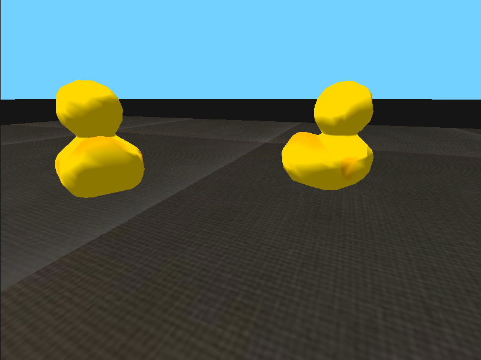
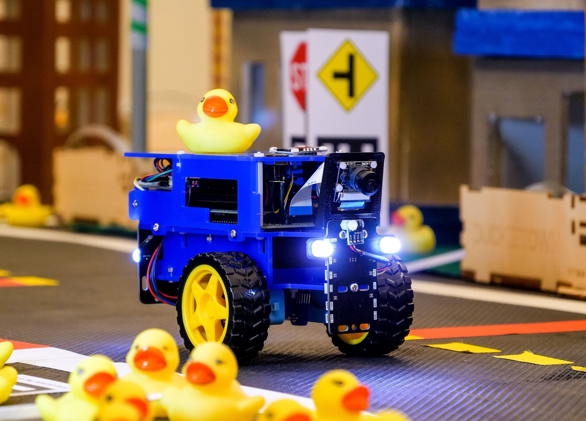

# Atividade - Veículos de Braitenberg

Nessa atividade você vai implementar um veículo de Braitenberg  assumindo que as fontes atratoras são patos, como na figura abaixo.

<figure>
  <div style="text-align: center">
  
  </div>
</figure>

Sua tarefa será implementar um robô que segue o comportamento "enamorado" (_lover_):

> O veículo se aproxima da fonte, mantendo-se a uma curta
> distância dela e evitando colisão com ela.

Vamos primeiro implementar o agente no simulador Duckievillage e depois re-implementá-lo no duckiebot.

## Sensor no Duckiebot

O robô que usamos neste curso possui como *sensor* uma única câmera frontal e como *atuadores* dois
motores para cada uma das duas rodas traseiras.

<figure>
  <div style="text-align: center">
  
  </div>
</figure>

Note que uma câmera digital é apenas uma coleção de sensores de luz organizados matricialmente.
Dessa forma, o veículo de Braitenberg a ser desenvolvido conecta cada ponto da imagem (pixel) aos motores.
Dada a forma matricial da imagem, vamos representar as conexões entre sensores e atuadores também como uma matriz.
Para esta atividade, vamos usar processar as imagens capturadas para produzir um sensor de patos 
(ou mais especificamente, da cor amarela).

## Sensor de cor

Para detectarmos os patos, vamos implementar um filtro de pontos da imagem pela cor (tal processamento é conhecida como _segmentação de imagem por cores_). O arquivo [ArquiteturasSesorimotoras01.ipynb](./ArquiteturasSesorimotoras01.ipynb) contém um _notebook_ do jupyter descrevendo como construir um filtro de segmentação por cores.
O resultado do filtro é uma matriz $`M\in\{0,1\}^{m\times n}`$ de máscara tal que
```math
M_{ij}=\begin{cases}
  1&\text{ se o pixel }(i,j)\text{ é da cor dos patos,}\\
  0&\text{ caso contrário.}
\end{cases}
```
Os valores $`m`$ e $`n`$ definem a largura e altura das imagens capturadas pela câmera do robô.

## Conexões com os motores

A arquitetura de um veículo de Braitenberg consiste em conectar diretamente os sensores aos atuadores.
Faremos isso definindo as matrizes de pesos de conexão $`E\in\mathbb{R}^{m \times n}`$ e $`D \in \mathbb{R}^{m \times n}`$.
Inspecione o arquivo [braitenberg.py](./braitenberg.py) e note como as matrizes são definidas para o caso simples do comportamento agressivo como matrizes binárias segmentando a imagem em partes esquerda e direita.

## Ativação

Tanto o comportamento agressivo como o comportamento enamorado podem ser implementados usando uma relação de ativação linear entre os sensores e os motores:

```math
p_e = c + g \cdot\frac{1}{z}\left(\sum_{i=1}^n\sum_{j=1}^m E_{ij}\cdot M_{ij} \right),
```
```math
p_d = c + g \cdot\frac{1}{z}\left(\sum_{i=1}^n\sum_{j=1}^m D_{ij}\cdot M_{ij} \right) .
```

Nas equações acima, $`p_e`$ e $`p_d`$ são os sinais enviados aos motores regulando a tensão elétrica (no intervalo $`[-1,1]`$), $`c`$ é uma constante que mantêm o robô sempre se movendo (pense como ativação mínima na ausência de estímulo), $`g`$ é uma constante de ganho que amplifica (ou atenua) os estímulos a fim de controlar a velocidade ou estabilizar o movimento, $`M`$ é a máscara obtida pelo filtro de cores e $`z`$ é uma constante de normalização para que a soma não cresça demais.

Note que as matrizes de ativação são equivalentes aos sensores de luz no problema clássico dos
veículos de Braitenberg. De forma parecida, podemos também mudar as conexões dos sensores para
implementar diferentes comportamentos.

## Tarefa

O arquivo [braitenberg.py](./braitenberg.py) contém um código inicial implementando o comportamento agressivo para o agente simulado. 
Sua primeira tarefa nesta atividade é modificar o arquivo [braitenberg.py](./braitenberg.py) para implementar o comportamento enamorado alterando as matrizes de conexões, e valores das constantes e do filtro de cor. As matrizes de conexão são definidas no construtor da classe `Agent`, o filtro é implementado no método `process` e as constantes de controle são definidas no método `send_commands`.

Para rodar o simulador:
Lembre-se que para acessar o simulador você deve antes ativar o ambiente:
```bash
cd ~/duckievillage
source bin/activate 
python3 assignments/braitenberg/braitenberg.py
```

Para sair do simulador, pressione `ESC`. Para reiniciar a simulação (sem precisar reiniciar o programa), pressione `BACKSPACE`
A tecla `ENTER` faz uma captura da tela e pode ser útil para calibrar o sensor e as matrizes de conexão.

## Submissão

Submeta sua solução (o arquivo [braitenberg.py](./braitenberg.py)) via e-disciplinas. 


Com isso pronto, você deve seguir para implementar no robô duckiebot. Para isso, siga as instruções em sala. 


