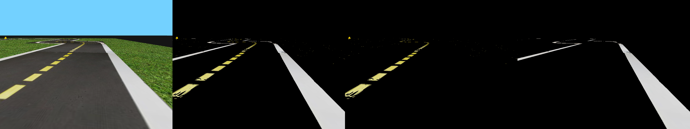
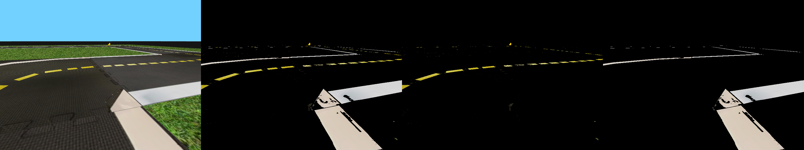

# Atividade - Veículo de Braitenberg com comportamento seguidor de pista 

Nesta atividade você deve implementar um caso de uso mais realista para os veículos de
Braitenberg. Sua tarefa aqui será construir um robô que se segue a faixa correta na pista no mundo simulado do duckietown (que possui um grau de padronização e homogeneidade longe das condições de trânsito de uma cidade real).

Para tanto, você deve pré-processar a imagem capturada pela câmera para identificar a Linha de Fluxo Oposto (LFO),
que consiste na linha amarela tracejada, e a Linha de Bordo (LBO), definida pela linha branca contígua. 
A figura abaixo mostra a visão do robô do mundo simulado (ou seja, a imagem capturada pela câmera), a imagem com as demarcações da pista filtradas, e imagens com cada tipo de demarcação identificada separadamente.

<figure>
  <div style="text-align: center">
  
  </div>
</figure>

Seu robô deve utilizar as linhas de demarcação como fontes atratoras/repulsoras e implementar um veículo de Braiternberg cujo comportamento faz o robô percorrer a pista na faixa correta. 
Sugerimos que você se inspire no comportamento enamorado para projetar um comportamento no qual o robô permanece a uma distância próxima tanto à LFO
quanto à LBO, sem se colidir com nenhuma das duas. Utilize o arquivo [lane_following.py](./lane_following.py) como base para construir seu agente.

## Filtrando pontos de interesse

De forma similar à atividade anterior, seu primeiro passo é projetar os filtros de segmentação por cor para identificar a LFO e LBO na imagem.
Modifique o método `Agent.preprocess` para produzir matrizes de máscara segmentando os pontos da imagem de acordo com a LFO e LBO. 
Note que os hiperespaços determinando os intervalos de filtragem das cores são definidos no método construtor da classe `Agent` (isto é, os vetores `self.inner_lower`,`self.inner_upper`, `self.outer_lower`, `self.outer_upper`).
Recomendamos que você construa uma máscara para cada tipo de demarcação (a implementação atual do método devolve as máscaras para LFO e LBO, independentemente, e também a união das duas máscaras).
A figura abaixo mostra um exemplo de imagem capturada pela câmera, a união das máscaras e cada uma das máscaras
individualmente.

<figure>
  <div style="text-align: center">
  
  </div>
</figure>


## Matrizes de conexão

Seu segundo passo é projetar as matrizes de conexão entre os sensores (as máscaras da imagem) e os motores:

```python
inner_left_motor_matrix  : np.ndarray
inner_right_motor_matrix : np.ndarray
outer_left_motor_matrix  : np.ndarray
outer_right_motor_matrix : np.ndarray
```
Faça os ajustes necessários das constantes regularizadoras no método `Agent.send_commands` para atingir o comportamento desejado.
Considere qual o comportamento do agente em retas e em curvas à esquerda e à direita.

## Avançado

Para esta atividade, vamos supor que o agente inicia em uma posição dentro da faixa correta. Como bônus, você pode considerar o caso no qual o agente inicia fora da faixa correta, seja na faixa da mão contrária, seja fora da pista. Como você pode modificar os parâmetros acima para deixar o robô robusto a tal situação?

## Submissão

Submeta sua solução final (o arquivo [lane_following.py](./lane_following.py)) via e-disciplinas.
