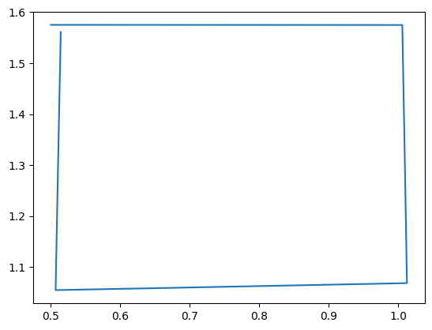
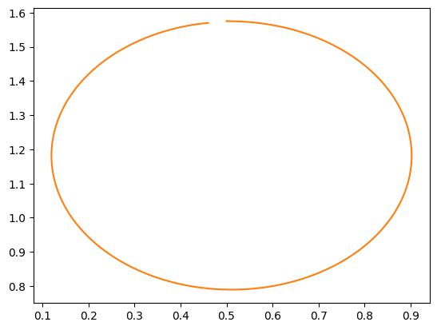
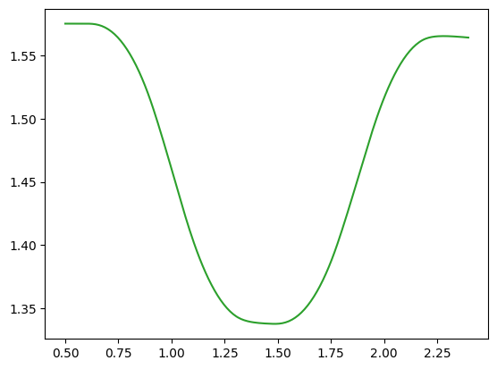

# Atividade 5 - Controle em Malha Aberta

Nesta atividade, você deve usar o modelo de veículo obtido na [Atividade 4](../model/), ou seja, 
os valores determinados para as constantes $`K_m`$ e $`K_t`$, para projetar as regras de controle
em malha aberta de agentes que executam as seguintes trajetórias:

1. Andar em um quadrado até voltar à posição inicial;
2. Andar em um círculo até voltar à posiçãi inicial;
3. Ultrapassar um obstáculo parado na pista.

Recomendamos que antes de prosseguir você leia o [Jupyter notebook sobre cinemática direta](../TeoriaDeControle03.ipynb) 
para se familiarizar com o desenho de regras de controle em malha aberta para um robô com direção diferencial. 

Para esta atividade, vamos usar o mesmo ambiente e mapa que usamos para a atividade passada.
Portanto, você pode usar as mesmas constantes encontradas na [Atividade 4](../model/) para esta
tarefa. 

## Implementando os agentes

O código [agents.py](./agents.py) usa uma classe base `Agent` contendo métodos comuns, como o
método `Agent.get_pwm_control`, que mapeia valores de velocidade do agente em valores de sinais de comando aos motores.
Copie essa função da sua solução para a [Atividade 4](../model/).

Como nas atividades anteriores, o comando do robô é efetuado pelo método `send_commands`, que tem
como argumento um variável `dt` do tipo `float`. Essa variável mede a o tempo desde a sua última chamada
de função. Você pode usá-la para controlar o tempo de uma ação do agente.

As classes derivadas `SquareAgent`, `CircleAgent` e `OvertakeAgent`, devem implemetar os respectivos comportamentos 
por meio do método `send_commands`. Você pode adicionar variáveis e métodos nestas classes sem restrição.

**Dica:** use `start` para definir um tempo inicial para a primeira ação.

## Desenhando as trajetórias

Você pode salvar a trajetória executada pelo robô com a tecla `P`. Para mudar de agente, use as
teclas `,` e `.`. Suas trajetórias devem se parecer com os seguintes exemplos:

<figure>
  

  
  
  
  

</figure>

Como nos exemplos acima, note que as trajetórias não conseguem retornar ao ponto de origem devido às imprecisões e imperfeições do modelo do robô (que são simuladas no simulador por meio de ruídos aleatórios).  

## Submissão

Submeta o arquivo `agents.py` contendo sua solução junto com os desenhos das trajetórias dos três agentes pelo
e-disciplinas.
