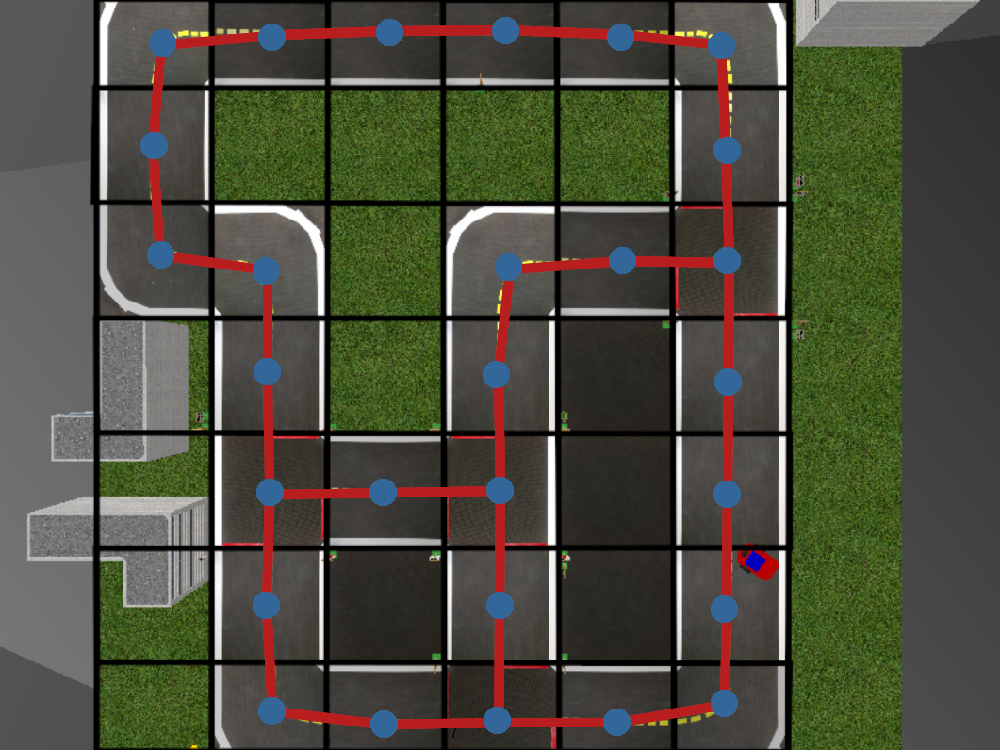

# MAC0318 Introdução à Programação de Robôs Móveis

## Projeto Final - O Problema do Carteiro-Pato-Robô Viajante

Patolândia está em perigo. Com o aumento das compras virtuais em virtude da pandemia de COVID, o
volume de carga dos Correios chegou ao limite, ou seja, não há carteiros-pato suficientes para
entregar todos os pacotes! O sistema está sobrecarregado e os índices de aprovação do atual
presidente-pato não param de despencar. E pior: bem na véspera de um ano eleitoral!

Para resolver esta crise, o Presidente Paulo Pato reuniu uma força tarefa com os melhores
pato-engenheiros e pato-computeiros de toda Patolândia para automatizar completamente o Correios e
trazer a paz novamente à terra dos patos. Com maestria ornitológica, os perspicazes
pato-engenheiros projetaram o pato-robô perfeito: com três rodas e uma câmera frontal, o *Patobô* é
capaz de fazer entregas 24 horas por dia, 7 dias por semana sem nem precisar parar para recarregar
a bateria. Porém, ainda falta o mais importante: o software.

Esse é um trabalho para vocês, pato-computeiros.

### Sua missão

A missão é simples: **salvar Patolândia antes que o país entre em caos**.

Usando o Patobô, que possue apenas dois motores para cada roda e uma câmera frontal, vocês devem
entregar todas as encomendas o mais rápido possível e voltar à sua posição inicial. Para isso,
vocês terão acesso a dois tipos de informação:

1. Sua posição inicial;
2. Um mapa topológico da cidade; e
3. Se a entrega de uma encomenda foi bem-sucedida.

Por causa do acidente espacial do ano passado, não teremos nenhum acesso a GPS. Vocês terão de usar
todas as suas habilidades de robótica e inteligência artificial para fazer a entrega apenas com as
informações acima. Que bom que vocês prestaram atenção em todas as aulas de MAC0318!

Além disso, para não causar mais caos nas cidades, o Presidente Paulo Pato ressaltou enfaticamente
que vocês devem seguir as três regras da pato-robótica:

1. O Patobô não deve machucar nenhum pato;
2. O Patobô não deve causar danos materiais à cidade;
3. O Patobô deve permanecer dentro dos limites da rua.

Para cumprir sua missão, vocês podem usar quaisquer técnicas, vistas em aula ou não, desde que
vocês obedeçam as três regras acima e apenas utilizem as informações dadas. O uso de informações
adicionais é proibido.

O seu código deve ser implementado a partir do arquivo [agent.py](./agent.py), que contém o código
para o agente do Patobô. Assim como nas tarefas anteriores, assume-se um erro nas rodas e portanto
temos as constantes usuais para o cálculo da modelagem `Agent.get_pwm_control`. O método
`Agent.send_commands` é encarregado de computar as ações do agente. Vocês opcionalmente podem usar,
assim como nas tarefas anteriores, o método `Agent.preprocess` para organizar o seu código em
diferentes módulos de percepção e controle.

**Importante:** todo o código deve ser implementado no arquivo `agent.py`, que será o único arquivo
código-fonte a ser entregue no e-disciplinas. No entanto, a execução da tarefa deve ser feita
através de [mailduck.py](./mailduck.py) por meio do comando:

```bash
python3 assignments/mailduck/mailduck.py assignments/mailduck/examples/n.mail
```

Onde o `n` acima é quaisquer um dos possíveis arquivos `*.mail` no diretório de exemplos para
execução, que iremos discutir mais abaixo.

### O que é observável?

Para guiar o robô em suas entregas e conseguirmos completar a missão do Patobô, vocês terão acesso
a três informações observáveis. A primeira é a posição inicial. Ela estará salva como uma variável
de instância de `Agent` com nome `initial_pos`, inicialmente inicializada no construtor da classe.

A segunda é o mapa topológico da cidade. Diferentemente da tarefa de planejamento de rotas, o mapa
topológico que usaremos é um grafo não-direcionado sem ponderações nas arestas. Cada nó é um
segmento reto de rua, curva ou intersecção. Uma aresta entre dois nós indica se as duas partes de
rua são conectadas. Além disso, cada nó do grafo possue uma bijeção com a sua posição no mapa de
tal forma que podemos inferir qual é o nó do grafo mais próximo dada uma posição, ou inversamente,
qual a posição específica de um nó em particular. A imagem abaixo mostra o grafo de uma cidade,
onde cada nó é representado pelos pontos azuis, e arestas por segmentos de linha vermelhos.

<figure style="text-align: center">
 
</figure>

Não é preciso construir o mapa. A inicialização do grafo é feita de forma automática. Para fazer
consultas no grafo, basta acessar a sua variável a partir do ambiente de simulação, que está
disponível a partir da variável `env` de dentro de uma instância de `Agent`. Assumindo que
seu código esteja sendo executado a partir de um método de `Agent`:

```python
# Assumindo self como uma instância de Agent e self.env como o ambiente de simulação
G = self.env.topo_graph # grafo topológico

N = G.nodes() # retorna uma lista de nós do grafo

e = G.edge(N[0], N[1]) # retorna True se existe uma aresta entre N[0] e N[1]; False caso contrário

v = G.closest_node((0.5, 1.5)) # retorna o nó mais próximo da posição (0.5, 1.5)

p, q = (0.5, 1.5), (3, 2.5)
W = G.path(p, q) # retorna uma lista de posições a serem seguidas para ir de p até q
```

Aqui nos interessa o método `G.path`, que faz uma busca no grafo para retornar o caminho ótimo de
um ponto a outro. Vocês podem usar esta informação para planejar a sua rota de entrega.  Cada nó é,
internamente, indexado por uma tupla $`(x,y)`$ representando a posição do nó no mundo.

A terceira informação disponível a vocês é se a entrega do pacote foi bem-sucedida. Para isso,
vocês usarão o método `Mailbox.deliver`, como o exemplo abaixo mostra.

```python
# Assumindo self como uma instância de Agent e self.env como o ambiente de simulação
M = self.env.mailbox

L = M.mail() # retorna uma lista de todos os pacotes (entregues ou não)

success = M.deliver(3) # tenta entregar o pacote de id 3
print(success) # retorna True se a tentativa foi bem-sucedida; False caso contrário
```

O método `Mailbox.mail` retorna uma lista de pacotes, onde cada $`i`$-ésimo pacote da lista é uma
tripla `(d,x,y)`: `d` é um Booleano indicando se o pacote $`i`$ já foi entregue, e `x`, `y` definem
a posição do endereço de entrega do pacote. Dizemos que $`i`$ é o identificador (id) do pacote, ou
seja, o índice do pacote na lista dada por `Mailbox.mail`.  O pacote é bem sucedido se a posição do
carrinho está a menos de $`0.2`$ unidades de distância do endereço do destinatário. Isso é feito
por meio do método `Mailbox.deliver`, que toma o id do pacote e retorna `True` se a entrega foi bem
sucedida, ou `False` caso contrário.

Toda vez que `Mailbox.deliver` é chamado para um pacote que já foi entregue, uma infração é
adicionada no relatório do Patobô. De forma parecida, quando um pacote é entregue no endereço
errado, ou seja, fora do raio de $`0.2`$ unidades do destinatário, uma infração também é adicionada
no relatório. Infrações contam como descontos na nota final do projeto.

### Navegando a pato-cidade

Além de planejar as rotas mais eficientes, o seu Patobô deve também executar a rota por meio de um
seguidor de pistas. Como vocês irão navegar a cidade está a cargo de vocês. Todas as técnicas
vistas em aula (ou não) são permitidas desde que não precisem de mais informação que o
estabelecido. Além disso, seu seguidor de pista deve obedecer as regras de trânsito e as regras da
pato-robótica. Ou seja, colisões com pato-pedestres, outros Patobôs, prédios, casas, cones de
trânsito ou qualquer outro objeto acarretará numa infração adicionada ao relatório do Patobô.
Infrações também serão dadas caso o Patobô saia dos limites da pista.

### Verificando seu relatório de infrações

O relatório de infrações é salvo em `/tmp/output.txt` quando o simulador é encerrado pela tecla
`ESC`. A escala de penalidade não é 1-para-1 com a nota final do projeto. Aplicaremos uma constante
a cada tipo de penalidade dependendo da dificuldade de resolução de cada uma delas. Um agente que
entrega todos os pacotes e termina no ponto inicial sem nenhuma infração a princípio deve receber
10 na nota final (a menos que informações não permitidas tenham sido utilizadas).

### Executando seu agente

A execução do seu Patobô depende de qual cidade ele estará localizado e de uma lista de encomendas
a serem entregues. Estas informações deverão ser passadas ao robô por meio de um arquivo de
listagem `.mail` contendo o mapa a ser carregado e uma lista de posições $`(i,j)`$. Cada $`(i,j)`$
é uma tupla representando a posição da entrega na grade do mapa. Obrigatoriamente $`(i,j)`$ deve
estar num trecho reto de rua. Vocês pode testar o seu Patobô nas situações dadas pelos arquivos em
[examples/](./examples/).

Opcionalmente, vocês também podem criar sua própria listagem. O arquivo
[make_order.py](./make_order.py) auxilia na criação de uma listagem aleatória. Para executar o
script, basta passar o caminho para o mapa `.yaml` e o número de pacotes a serem entregues.

```python
  # Gera uma listagem mylist.mail no mapa mailduck1_dense.yaml com 14 pacotes a serem entregues
  python3 assignments/mailduck/make_order.py maps/mailduck1_dense.yaml 14 > mylist.mail
```

Para executar esta listagem, basta executar `mailduck.py` passando a listagem como argumento.

```python
python3 assignments/mailduck/mailduck.py mylist.mail
```

### Entrega

Vocês devem entregar os seguintes itens para o projeto final:

1. Seu código `agent.py`;
2. Quaisquer materiais, dados, redes neurais, etc. que são necessários para executar o código;
3. Um vídeo do seu agente executando pelo menos um dos casos em [examples](./examples).

Para o item (3), vocês podem utilizar a gravação automática por meio da variável de construção
`video_path` na criação do ambiente em [mailduck.py](./mailduck.py).

<br>

**Boa sorte e bom trabalho! Patolândia conta com vocês!**
