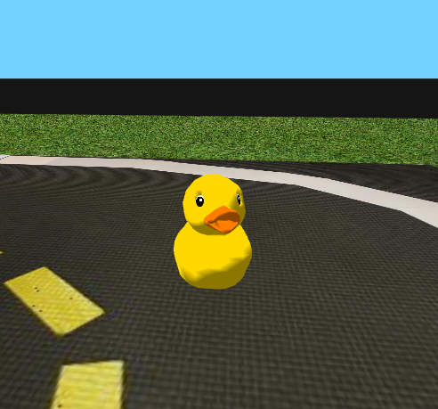

# Atividade 7 - Campos Potenciais

Nesta atividade, você irá projetar um planejador de movimento reativo baseado na técnica de Campos Potenciais para perseguir um alvo móvel evitando colisões com obstáculos. Nosso alvo será o pato meliante da figura abaixo e os obstáculos serão casas, ônibus e outros patos imóveis.

<figure>
  <div style="text-align:center;">
  
  </div>
</figure>

## Tarefa

Antes de iniciar esta tarefa, complete o [notebook Campos Potenciais](./Campos%20Potenciais.ipynb).

Para completar a tarefa, você deve editar o arquivo [agent.py](./agent.py), que contém um código base para implementação de um agente perseguidor baseado em campos potenciais. As funções para cálculo de distância entre pontos, entre ponto e linha e entre ponto e objeto (polígono) já estão implementadas. Você deve implementar as funções que calculam os potenciais de atração e repulsão, e o cálculo de um passo do algoritmo de gradiente que gera uma nova pose.

Para rodar o simulador:
Lembre-se que para acessar o simulador você deve antes ativar o ambiente:
```bash
cd ~/duckievillage
source bin/activate 
python3 assignments/p-fields/agents.py
```

## Planejador

Seu agente possui conhecimento da sua localização no referencial fixo (posição $`x`$ e $`y`$ e orientação $`\theta`$), das localizações do alvo móvel e dos obstáculos no referencial fixo. Os obstáculos são representados como obstáculos e especificados como uma lista de vértices e o alvo é representado como um ponto.
Sugerimos dividir o problema em duas tarefas:

1. Planejador de trajetória
2. Seguidor de trajetória

A tarefa 1 pode ser realizada por um planejador de trajetória baseado em Campos Potenciais que fornece, a cada instante, uma posição (ponto) alvo a ser atingido (seguido). Assumindo a especificação das funções de forças de atração ao alvo $`F_{att}(q)`$ e repulsão dos obstáculos $`F_{rep}(q)`$, o ponto alvo
```math
q_{t+1} = \begin{bmatrix} x_{t+1} & y_{t+1} \end{bmatrix}^t
```
é obtido pela equação
```math
q_{t+1} = q_t + \alpha ( F_{att}(q_t) + F_{rep}(q_t) )\, ,
```
onde $`q_t = \begin{bmatrix} x_t & y_t \end{bmatrix}^t`$ é a posição atual do agente e $\alpha$ é um parâmetro da otimimzação chamado de tamanho do passo.
```math
q_{t+1} = q_t + \alpha ( F_{att}(q_t) + F_{rep}(q_t) )\, ,
```

onde $`q_t = \begin{bmatrix} x_t & y_t \end{bmatrix}^t`$ é a posição atual do agente e $\alpha$ é um parâmetro da otimimzação chamado de tamanho do passo.

Em termos de código, a função `F_att(p, g)` retorna a força atratora do objetivo cuja posição é `g`, aplicada ao robô na posição `p`.
Da mesma forma, `F_rep(p, o)` retorna a força de repulsão do obstáculo `o` quando o robô está na posição `p`.

Você deve implementar a função `preprocess(p, g, P)` para que ela devolva o ponto $`q_{t+1}`$. Esta função toma como argumentos a posição atual `p` do robô, a posição do objetivo `g` e `P` uma lista de obstáculos.
Esta última é dada pronta por meio da função `env.poly_map.polygons()`, que retorna uma lista de todos os obstáculos do mapa. Cada obstáculo é representado por um lista de polígonos, onde cada polígono é dado por uma lista de pontos.

```python
> print(env.poly_map.polygons()

# Primeiro poligono
[[[1.53161723 2.68214108]
  [1.39146296 2.68214108]
  [1.39146296 2.54200763]
  [1.53161723 2.54200763]]

# Segundo poligono
 [[1.43288123 1.73993873]
  [1.43288123 1.65275427]
  [1.4934864  1.65275427]
  [1.4934864  1.73993873]]

  ...

 [[3.18066996 0.1897497 ]
  [3.83932942 0.1897497 ]
  [3.83932942 0.39525046]
  [3.18066996 0.39525046]]

 [[4.56868552 0.37031423]
  [4.20631448 0.37031423]
  [4.20631448 0.21468577]
  [4.56868552 0.21468577]]]
```

Note que não é necessário modificar ou acessar as partes internas dos polígonos para resolver o problema, dado que a função de distância a um objeto é dada pronta.

## Controlador

O ponto $`q_{t+1}`$ pode então ser usado para projetar sinais de controle de velocidade linear $`v`$ e angular $`\omega`$ para o agente.
Nessa proposta, o ponto alvo nunca é de fato alcançado (visto que o alvo é móvel).
Você deve implementar na função `send_commands` um controlador proporcional de velocidade do robô para seguir o ponto $`q_{t+1}`$ devolvido pela função  `preprocess` a cada instante de decisão.


## Submissão

Submeta sua solução (o arquivo [agents.py](./agents.py)) via e-disciplinas. 
