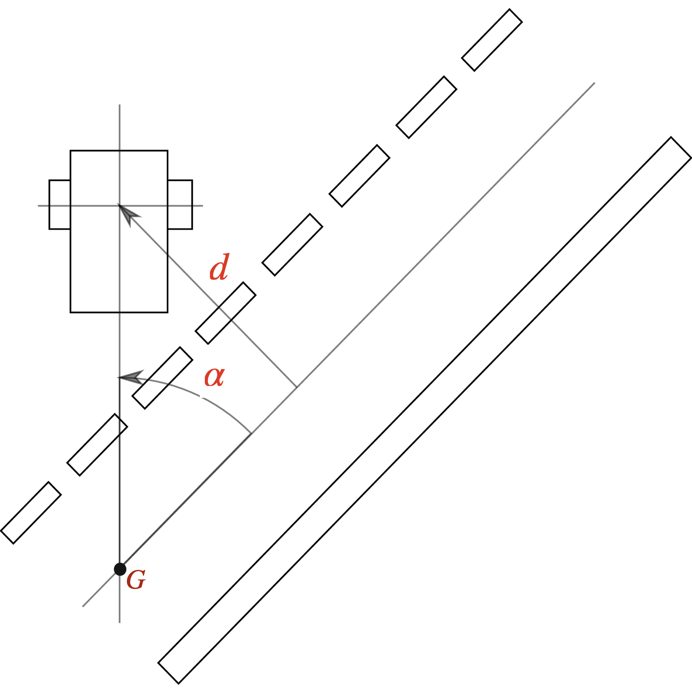

# Atividade 6 - Controle PID

Nesta atividade você irá projetar um controlador PID para o robô seguidor de faixa no simulador. 

## Percepção

Vamos assumir que temos um sensoriamento perfeito pelo qual conseguimos medir a distância $`d`$ ao centro da faixa e o ângulo $`\alpha`$ formado pela orientação do robô e a linha tangente ao centro da faixa, como indicados na figura abaixo:

<figure>
  <div style="text-align:center;">
  
  </div>
</figure>

Vamos assumir ainda que os dois valores são combinados conforme a equação abaixo para forma um único sinal de saída:

```math
  y=Cd+\alpha \, ,
```
em que $`C`$ é uma constante que pondera a importância de cada componente no ajuste final.
O arquivo [agent.py](./agent.py) contém um método `Agent.preprocess` que simula o sensoriamento e devolve o valor $`y`$ para cada instante do tempo.
A implementação fornecida assume que $`C=6`$, mas você pode alterar esse valor como achar conveniente (e também deixá-lo nesse valor, se preferir).


## Controle PID

<figure>
  <div style="text-align:center;">
  
  </div>
</figure>


Você deve determinar as constantes $`K_p`$, $`K_d`$ e $`K_i`$ de um controlador PID para que o robô percorra a pista dentro da respectiva faixa, de maneira estável, responsiva e não oscilatória. Para ajustar as constantes, você pode seguir a abordagem de ajuste manual ou alguma abordagem semi-empírica.
O seu controlador deve manter uma velocidade longitudinal $`v`$ constante (sugerimos, $`v=0.2`$), e controlar a taxa de rotação ou velocidade angular $`\omega`$ de acordo com o erro $`e(t)=0-y(t)=-y(t)`$. 
Sugerimos que você se familiarize com o projeto de controlador PID resolvendo o exercício proposto no [notebook](./ControlePID.ipynb) fornecido *antes* de começar esta tarefa.
Quando estiver contente com o seu agente, submeta o arquivo `agent.py` via e-disciplinas.

