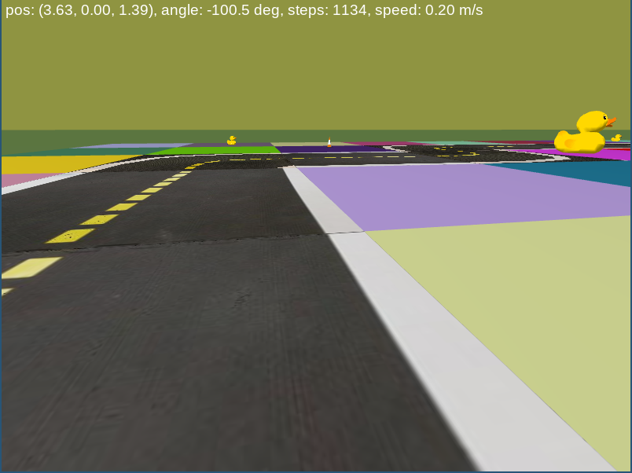
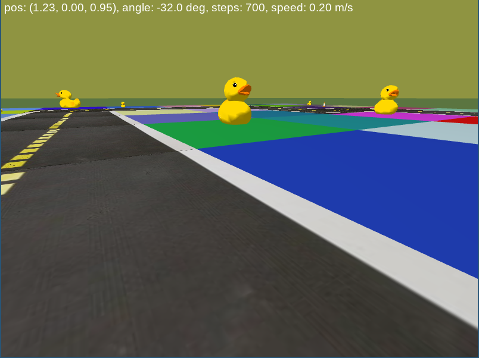

# MAC0318 Introdução à Programação de Robôs Móveis

## Atividade 9 - Controlador seguidor de pista por redes neurais convolucionais

Na [atividade anterior](../regression/), você implementou um agente seguidor de pista que usava uma rede neural para estimar o valor de saída do sistema $`y=6d+\alpha`$, onde $`d`$ e $`\alpha`$ são mostrados na figura abaixo. A estimativa de $`y`$ era então usada por um controlador PID [implementado anteriormente](./pid-control).

<figure style="text-align: center">
   
</figure>

A rede neural construída usava apenas camadas densas, e foi aprendida a partir de um conjunto fornecido de capturas da imagens da camera do robô (simulado) pré-processadas e rotuladas com seus respectivos valores $`y`$. Esse tipo de abordagem é conhecida como [servocontrolador visual baseado em posição](https://en.wikipedia.org/wiki/Visual_servoing). 

Nesta atividade, ao invés de separarmos o agente em módulo de percepção (estimação de saída) e controle, iremos usar um
modelo de rede neural convolucional para predizer as velocidades diretamente a partir da imagem, com mínimo pré-processamento (isso é chamado de aprendizado fim-a-fim, ou _end-to-end_). Isto é, contruíremos um servocontrolador visual baseado em imagens a partir dos valores dos pixels em RGB. Além disso, deixaremos a construção do conjunto de dados rotulados a seu encargo. 

Antes de implementar sua solução, recomendamos fortemente que você leia e replique as atividades nos notebooks fornecidos sobre [Aprendizado de características](./Aprendizado de características.ipynb) e [redes neurais convolucionais](./Redes Neurais Convolucionais.ipynb).

### Coletando os dados

Você precisará de dois comportamentos diferentes: um para coletar dados (que serão usados para treinar uma rede neural convolucional) e outro para implementar o agente seguidor de pista usando a rede aprendida. Para isso, o arquivo [agent.py](./agent.py) contém duas classes de agentes: `DataAgent` e `EvaluationAgent`. A primeira classe deve ser utilizada para a coleta de dados necessários para treinar nosso
modelo, enquanto que o outro avaliará a rede treinada. Para isso, seu agente `DataAgent` deve implementar um seguidor de pista usando [controle PID](../pid-control) e coletar um conjunto de dados de imagens da câmera rotuladas com as respectivas ações (velocidade linear $`v`$ e velocidade angular $`\omega`$) enviadas pelo controlador.

**Note que o código fornecido do agente `DataAgent` implementa um controlador proporcional simples, que possui comportamento oscilatório nas curvas. Você deve subsituir esse controlador pelo seu [controlador PID](../pid-control) desenvolvido anteriormente.**


**Instruções:** Você deve projetar uma estratégia de coleta de imagens a fim de obter um conjuto de dados relevante e de tamanho adequado (nem muito pequeno, nem muito grande). Alguns aspectos a serem considerados

- O conjunto deve conter variabilidade suficiente para que o modelo aprendido **generalize** bem a imagens fora do conjunto de treino. Isso quer dizer que você deve obter dados de poses variadas e bem distribuídas -- por exemplo, imagens em linhas retas (muito mais abundantes) devem ser equilibradas com imagens em curvas; outra questão é coletar "frames" espaços no tempo, pois frames temporalmente próximos fornecem pouca novidade um em relação ao outro.

- É importante considerar comportamentos fora da operação ideal, para que seu agente aprendido saiba se recuperar de erros; ou seja, você deve obter imagens de poses fora do trajeto ideal do robô. Você pode fazer isso guiando manualmente o robô para poses que o agente com o controlador PID 
não alcançaria normalmente (mas não se esqueça de gravar apenas as ações que o controlador tomaria e
não as ações manuais que levam o robô para fora da posição desejada).

- É possível que você precise alternar entre coleta de dados e aprendizado para avaliar a qualidade dos dados obtidos e investigar possíveis melhorias (por exemplo, observando as imagens nas quais o modelo apresenta o maior erro de predição, e aumentando o conjunto de dados com imagens similares).

O método `DataAgent.send_commands` redimensiona as imagens para o tamanho $`80\times 60`$ pixels e rotula cada
imagem com a velocidade linear e angular. A função `on_key_press` salva as imagens e rótulos com o pressionar do botão `ESC`.
Você tem liberdade para alterar essa estratégia de captura de dados, de tamanho da imagem a forma como os dados são coletados.

### Treinando seu modelo

Assim que você tiver um conjuto de dados adequado, você deve treinar uma modelo para prever as velocidades (sinais de controle) a partir das imagens, **sem realizar a segmentação por cores** (você ainda pode redimensioná-las e descartar a porção acima do horizonte para diminuir o custo computacional). 
Construa e otimize uma rede neural convolucional que toma como entrada imagens coloridas em RGB (possivelmente no tamanho $`80 \times 60`$) e prediz o sinais de comanda de velocidades do agente. Recomendamos realizar esse processo de aprendizado usando um notebook do [Google Collab](http://colab.research.google.com/). Lembre-se de utilizar a metodologia vista em sala (separação treino-teste) e salvar o modelo aprendido.

Quando estiver satisfeito com o desempenho do seu modelo, implemente o agente seguidor na classe `EvaluationAgent`.
Essa classe fornece uma pontuação pela variável `self.score` que avalia a qualidade da trajetória executada pelo seu agente (em relação ao centro da pista). Você pode usar essa pontuação para comparar diferentes modelos preditores. Em nossos testes, um bom agente obteve pontuação entre 0,98 e 1,1; um agente ruim mas que seguia na pista ficou com pontuação entre 0,7 e 0,85. Já uma pontuação negativa indicava um agente que não permanecia na pista.

### Verificando a robustez

Após obter um comportamento de seguidor de linha satisfatório, altere a seguinte linha do construtor da classe `EvaluationAgent`

```python
super().__init__(environment, randomize = False)
```

para

```python
super().__init__(environment, randomize = True)
```

Essas alterações fazem com que a cobertura do solo seja alterada para exibir um padrão de preenchimento arbitrário, como nas figuras abaixo.

<figure style="text-align: center">
   
   
</figure>

Execute novamente o seu agente após a mudança. Você deve observar uma piora significativa do comportamento do agente.
Isso acontece pois sua rede estava usando informações espúrias como a cor da grama para predizer as ações de controle. 
Algo similar acontece com carros autônomos em situações reais; por exemplo, a cor do céu, que é uma informação utilizada para prever a linha do horizonte, normalmente se apresenta dentro de uma gama de cores limitadas (azul a branco). No entanto, em condições muito específicas (como em cidaddes próximas a incêndios), o céu pode exibir uma cor inesperada e ser confundido com outra parte da cena. Por exemplo, a imagem abaixo 
retrata uma cidade na Califórnia durante os incêndios de 2020. É razoável (e particularmente
desejável) esperar que o carro continue funcionando durante situações incomuns como esta.

<figure>
  <div style="text-align:center;">
  
  <figcaption><b>Fonte:</b> Wikipedia</figcaption>
  </div>
</figure>

Para obter um agente robusto a mudanças do tipo de cobertura do solo fora da pista (que é algo que não esperamos ter uma grande variabilidade), mude a mesma linha de código acima no construtor da classe `DataAgent` e colete mais dados com ambiente "aleatorizados". 
Incorpore os novos dados aos conjunto de dados anteriores e retreine o modelo. 
Após o treino, compare seu agente em situações aleatorizadas (`randomize = True`) e "normais" (`randomize = False`).

**Opcional:** você pode repetir o aprendizado realizando a segmentação por cores (extração de características) antes de passar as imagens pela rede. Compare nesse caso a redução de desempenho do modelo aprendido nos mundos não aleatórizados quando implementado no mundo aleatorizado. 

### Submissão

Submeta o arquivo `agent.py` no e-disciplinas. Como o edisciplinas possuem um limite de arquivos, não é possível submeter o arquivo da rede neural. Para que possamos avaliar sua solução, coloque todos os arquivos adicionais necessários (por exemplo, o arquivo `.hp5` contendo a rede) em uma pasta no seu Google Drive e mencione o link no cabeçalho do arquivo `agent.py` submetido.
