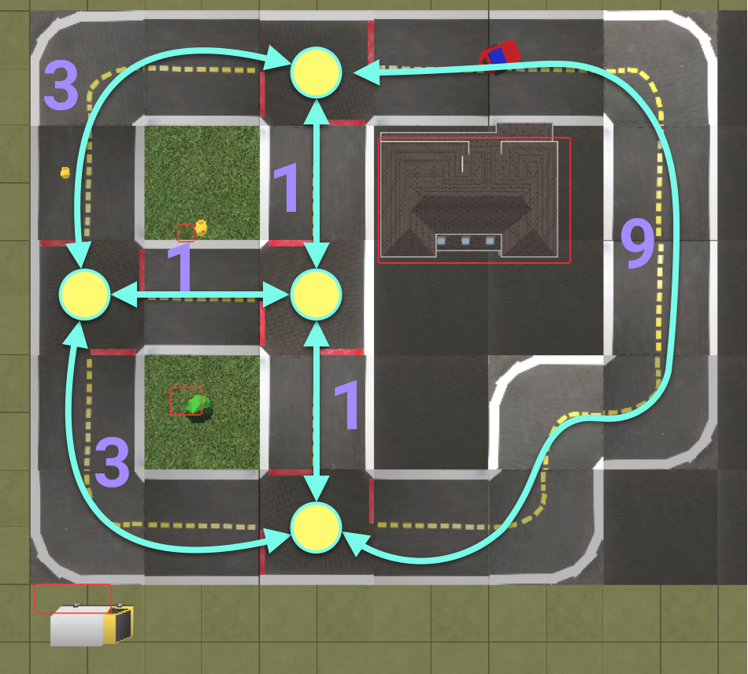
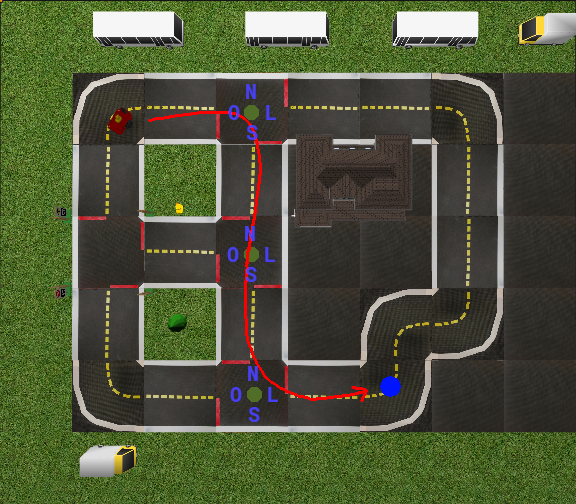
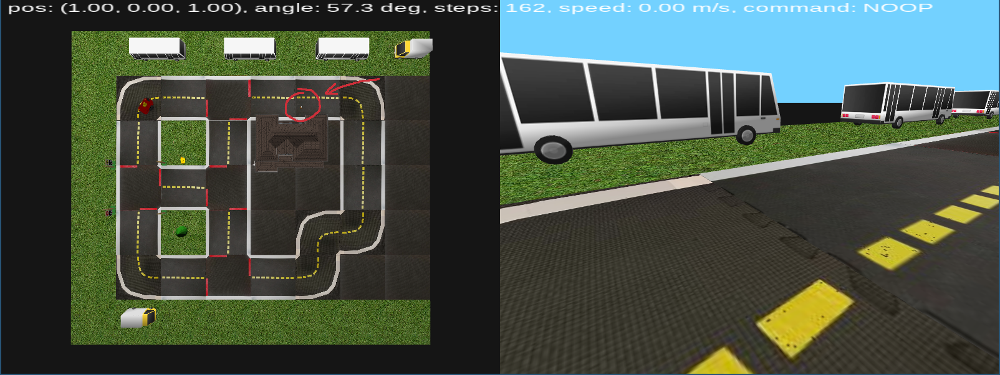

# MAC0318 Introdução à Programação de Robôs Móveis

## Atividade 12 - Planejamento de rotas

Nesta atividade, você irá aprimorar um agente já implementado. O agente dado planeja uma rota entre
dois trechos de rua e executa o plano usando um seguidor de pista. Como visto nas atividades
anteriores, o robô usa uma rede neural como seguidor de pista, retornando diretamente as
velocidades a serem aplicadas de forma parecida com a atividade de
[Aprendizado por Imitação](https://gitlab.uspdigital.usp.br/mac0318-2021/assignments/-/tree/master/imitation).
No entanto, a rede não sabe o que fazer quando chega num cruzamento, e por isso foram implementados
comandos usando malha aberta para as ações em cruzamentos. Sua tarefa nesta atividade é implementar
os mesmos comandos nos cruzamentos porém em malha fechada.

### Planejamento de rotas

O planejador de rotas já é dado pronto nesta atividade, porém vamos brevemente discutir como o
planejamento foi implementado. Seja $`G=(V,E,w)`$ um grafo não-direcionado onde cada vértice $`v\in
V`$ possue uma correspondência 1-para-1 com cada cruzamento do mapa, e uma aresta $`e=(u,v)\in E`$
existe se e somente se o cruzamento $`u`$ possue uma ligação na forma de um trecho de rua com o
cruzamento $`v`$. Suponha uma função $`w:V\times V\to\mathbb{N}`$ que toma dois cruzamentos e
retorna um inteiro não-negativo correspondente ao número de trechos de rua de um caminho partindo
de $`u`$ até chegar a $`v`$ de forma que tal caminho não possua nenhum cruzamento. Tal grafo
ponderado define o nosso mapa topológico, como o exemplo abaixo mostra.

<figure>
  <div style="text-align:center;">
  
  </div>
</figure>

Note que cada cruzamento possue no máximo quatro possíveis arestas, uma para cada ponto cardeal:
norte, leste, sul, oeste. Portanto, um plano para o menor caminho entre dois pontos $`p`$ e $`q`$
pode ser facilmente traduzido como o menor caminho ponderado em $`G`$, com cada aresta/ponto
cardeal definindo o que deve ser feito pelo agente em cada cruzamento (siga em frente, vire a
esquerda ou direita).

Para esta atividade, já implementamos o [algoritmo de Dijkstra](https://gitlab.uspdigital.usp.br/mac0318-2021/duckievillage/-/blob/35c9305057995fb175c37f256a0e1e277d05c171/duckievillage.py#L339)
para achar o menor caminho em $`G`$. A função [`env.junction_graph.path`](https://gitlab.uspdigital.usp.br/mac0318-2021/duckievillage/-/blob/35c9305057995fb175c37f256a0e1e277d05c171/duckievillage.py#L326)
toma a posição inicial $`p`$ e final $`q`$ e computa o menor caminho entre $`p`$ e $`q`$,
retornando uma lista cujos elementos são duplas da posição de cada cruzamento e qual direção do
cruzamento deve ser tomada. Por exemplo, o caminho da imagem abaixo retornaria a seguinte lista:

<figure>
  <div style="text-align:center;">
  
  </div>
</figure>

```python
[
  ((2.0475, 0.8775), 's'),
  ((2.0475, 2.0475), 's'),
  ((2.0475, 3.2175), 'e')
]
```

O segundo elemento de cada dupla é dado por `n` para Norte, `e` para Leste, `s` para Sul e `o` para
Oeste. A função `Agent.go_to` no [esqueleto do código](https://gitlab.uspdigital.usp.br/mac0318-2021/assignments/-/blob/master/route-planning/agent.py)
toma a posição $`q`$ e chama `env.junction_graph.path`. Note que não usamos a posição real do
carrinho, mas uma posição com um certo erro para simularmos um ambiente mais realista.

**Nota:** se tivéssemos a posição e direção reais, a execução da rota seria trivial.

### Execução do plano

Para executarmos o caminho que planejamos, precisamos ter alguma estimativa de nossa posição. Como
já brevemente mencionado, isto é feito com uma medição (com erro) através de um simulador de GPS
dado pela função `env.gps.track`. A partir dessa estimativa, podemos inferir de onde o carrinho
está vindo e portanto qual saída do cruzamento tomar (por exemplo, se viermos do Norte e
precisarmos tomar a saída Leste, então precisamos fazer uma virada à esquerda). A função
`Agent.intersection_command` retorna a tomada de decisão correspondente dadas as direções do
carrinho e saída do cruzamento no plano. A execução desta tomada de decisão em cada cruzamento é
feita, no esqueleto do código, por uma ação em malha aberta: por um tempo determinado, velocidades
lineares e angulares constantes são dadas ao agente.

Para trechos que não possuem cruzamentos, a execução se reduz ao problema do seguidor de pista.
Nesta atividade vamos usar uma rede neural para fazer predizer as velocidades lineares e angulares
em trechos sem cruzamento. Para facilitar o aprendizado, usamos filtros de cores para identificar
apenas as características mais relevantes: as linhas brancas contíguas, amarela tracejada e as
marcações vermelhas presentes em cruzamentos. Além disso, removemos o horizonte e redimensionamos
as imagens para $`80\times 42`$. Uma rede pronta já é
[dada](https://www.ime.usp.br/~renatolg/mac0318/lf_cnn.h5), porém você pode usar a sua própria ou
treinar uma nova a partir de dados prontos dados (veja abaixo para mais informações).

### Implementando cruzamentos por malha fechada

Como já dito, o código dado implementa as ações em cruzamentos por malha aberta. Ao rodar o código
você verá claramente que existem várias desvantagens nesta abordagem, por exemplo: certas viradas
requerem diferentes velocidades dependendo de qual faixa tomar, ou caso haja alguma imperfeição o
carrinho pode acabar na contramão ou sair da pista. Para melhorar a execução dos cruzamentos, você
reimplementar as ações por malha fechada. A escolha de qual método usar (por Braitenberg,
aprendizado supervisionado, campo potencial, etc.) é livre.

Caso você escolha o aprendizado supervisionado, você pode usar os seguintes dados prontos:

- [`images_full.npy`](https://www.ime.usp.br/~renatolg/mac0318/images_full.npy)
- [`labels_full.npy`](https://www.ime.usp.br/~renatolg/mac0318/labels_full.npy)
- [`commands_full.npy`](https://www.ime.usp.br/~renatolg/mac0318/commands_full.npy)

Todos os dados acima possuem 8299 instâncias. `images_full.npy` contém as imagens segmentadas pelo
filtro de cores usado no esqueleto, com o horizonte removido e redimensionadas para $`80\times
42`$; `labels_full.npy` contém as velocidades lineares e angulares para regressão; e
`commands_full.npy` contém os comandos dados em cada cruzamento: `-1` caso não esteja num
cruzamento, `0` caso o agente deva seguir reto, `1` caso deva virar à direita, e `2` para virar à
esquerda.

### Interação visual

Para acionar o planejador de rotas, você pode usar o mouse para escolher um trecho de rua como
destino no painel da esquerda. A posição correspondente no simulador aparecerá na forma de um cone.

<figure>
  <div style="text-align:center;">
  
  </div>
</figure>

Note que o código espera que o carrinho esteja num trecho de rua e com orientação paralela ao
sentido da faixa. Caso queira testar diferentes caminhos, é interessante implementar a direção
manual para posicionar o carrinho na pose desejada.
